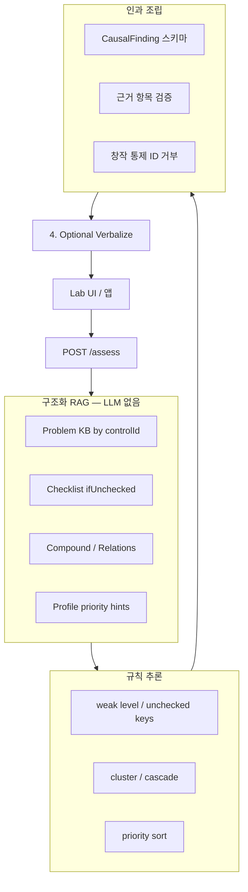

# 인과 검색(Causal Retrieval) 고도화 로드맵

> **상태:** 설계 착수 (2026-07-23)  
> **목표:** LLM 도입 전에 **체크 입력 → 문제 → 영향** 인과를 논리적으로 고정하고, 방식 B(백엔드 API + 프론트 연동)로 제품화한다.  
> **원칙:** 추론은 규칙/KB, 검색은 구조화 retrieve, LLM은 (선택) facts-only 문장화만.

관련 문서:

- `docs/VERBALIZING_INFERENCE_ARCHITECTURE.md` — Verbalizing Inference 가정/구현
- `docs/OSE_ISMS_VS_OURS_COMPARISON.md` — 오상 RAG와의 차별
- `to do.md` — 완료 이력 + 본 로드맵 요약 체크리스트

---

## 1. 한 줄 정의

사용자가 받는 결과는 **“무엇이 문제다”**가 아니라:

> **내가 체크한(또는 충족하지 못한) 항목들 때문에 → 이런 문제가 생기고 → 이런 운영/심사 리스크를 야기할 수 있다**

를 **근거 항목이 명시된 인과 체인**으로 보여 주는 것이다.

---

## 2. 현재 상태 (As-Is)

| 계층 | 구현 | 한계 |
| --- | --- | --- |
| 조직 프로파일 / 범위 초안 | 완료 | 인과 UI와 직접 연결은 약함 |
| Problem KB (`ifUnchecked`) | 완료 | 통제별 체크→문제 매핑은 존재 |
| `control_problem_engine` | 완료 | `checklistItem` → `problems` 산출 |
| Assess API / Lab UI | 완료 | 카드에 항목/문제는 나오나 **「때문에」 문장 스키마가 없음** |
| Verbalizing | 완료(옵션) | 갭 서술 중심, **체크 근거 체인 강제 약함** |
| 문서/벡터 RAG | 없음 | 의도적으로 후순위 (오상 추종 회피) |

**핵심 갭:** 데이터는 인과를 만들 수 있는데, **응답/화면/검증이 “원인 항목 집합 → 문제”를 1급 객체로 다루지 않는다.**

---

## 3. 목표 상태 (To-Be)

### 3.1 인과 체인 (1급 스키마)

모든 문제 카드/리포트 줄은 최소 아래를 만족한다.

```text
because[]          # 사용자가 남긴 입력 근거 (체크 미충족 / level / 프로파일 조건)
  → problem        # KB에서 회수한 문제 진술 (창작 금지)
  → impacts[]      # operational / audit
  → mayCause[]     # 선택: 연관 통제/복합 시나리오 (그래프/compound만)
  → remediation    # 조치
```

예시 문장 템플릿 (규칙 엔진이 생성, LLM은 다듬기만):

> **때문에:** `2.9.4` 체크 2「로그 보관 기간이 …」미충족  
> **문제:** 사고 후 ‘누가 했는지’ 증명 불가  
> **야기:** 침해사고 조사/과징금 대응에서 중대 약점  
> **이어질 수 있음:** `2.9.5` 로그 점검 공백 (관계 그래프)

### 3.2 파이프라인 (방식 B)



**Structured Retrieve = 본 프로젝트의 RAG.**  
벡터 문서 RAG는 Phase 4 이후 선택(증적 Q&A용). 판정/갭 생성에는 쓰지 않는다.

### 3.3 품질 게이트

| 게이트 | 규칙 |
| --- | --- |
| 근거 필수 | `source=checklist`면 `because`에 실제 `checklistItemId` ≥ 1 |
| 입력 정합 | `because`의 controlId/itemId는 요청 assessments/checks의 subset |
| 창작 금지 | 응답 통제 ID ⊆ KB ∪ 요청 집합 |
| 수치 고정 | readiness/gapCount는 1단계 결과 불변 |
| 폴백 | Verbalize 실패 시 인과 템플릿 문장 유지 |

---

## 4. 비목표 (이번 로드맵에서 하지 않음)

- 증적 업로드 GRC / 버전관리 포털 (오상 영역)
- LLM이 새 통제/새 결함을 판정
- 합격/불합격 단정
- 범용 문서 챗봇을 갭 분석의 주엔진으로 사용

---

## 5. 페이즈별 TODO

### Phase 0 — 설계 고정 (본 문서)

- [x] 인과 체인 원칙/비목표/파이프라인 정의
- [x] `CausalFinding` JSON 스키마 초안을 `schemas.py`에 반영
- [x] UI 카피 가이드: “때문에 / 문제 / 야기 / 이어짐” 4칸 고정
- [x] 수락 기준(Acceptance) 시나리오 3건 확정 (§7) + 테스트로 일부 검증
- [x] P0.5 Grounding: 성숙도↔도메인 항목을 **checkKey 명시 매핑**으로 전환 (`maturity_proxy` 표기)

### Phase 1 — Causal Chain을 API 1급 객체로

**목표:** 프론트가 추론 없이 인과를 렌더할 수 있게 한다.

- [x] `IndividualProblem`에 `because` / `causalStatement` / `impacts` / `mayCause` 필드 추가
- [x] `CompoundSynthesis`에 `because` + `becauseChecklistRefs` + `causalStatement` 명시
- [x] `control_problem_engine`에서 because 조립 (`checkKey` resolve)
- [x] Assess 응답 `problemAnalysis.causalFindings` dual-write
- [x] 단위 테스트: 부분 이행 because 정합 / reviewed≠policy 혼동 방지 / API 노출
- [x] 회귀: CausalFinding 계약 게이트(`causal_contract`) + assemble 필터
- [x] Verbalize Context Packet에 `causalFindings` top-N 포함

### Phase 2 — Lab UI 인과 전면화

**목표:** “문제 목록” UX → “때문에 → 문제 → 야기” UX.

- [x] 문제 카드 레이아웃을 4섹션으로 개편 (`control_map.html`)
- [x] 필터: 통제 / 체크항목 / severity / compound (체크항목 검색 포함)
- [x] 갭 narrative / executive에 **체크 근거 bullet** 노출 (`causalBasis`, `[체크 근거]`)
- [x] “이 항목을 충족으로 바꾸면 사라지는 문제” 미리보기 (`POST /controls/preview-check-impact`)
- [x] 면책 문구 유지: 실제 심사 대체 아님
- [x] 갭 경로(`build_gap_insights`)에도 controlChecks grounding 연결
- [x] UI가 `causalFindings`를 우선 렌더 (없으면 individualProblems 폴백)

### Phase 3 — Structured Retrieval 계층 정리 (방식 B 백엔드)

**목표:** API 서버 안 파이프라인을 명시적 모듈로 분리해 앱 통합이 쉬워지게 한다.

- [x] `retrieve_control_facts(control_id)` — KB 로드 단일 진입점 (`causal_retrieve.py`)
- [x] `retrieve_unchecked_findings(assessments, control_checks)` — 입력→미충족 항목
- [x] `assemble_causal_findings(...)` — Finding 리스트만 반환
- [ ] `analyze_assessment`는 위 함수 조합으로 추가 리팩터 (현재는 호출 연결 완료, 내부 분리 여지)
- [x] OpenAPI/README에 “Structured RAG → Inference → Causal → Verbalize” 순서 명시
- [x] `.env.example`: verbalize는 옵션, retrieve/causal은 항상 동작 (문구 보강)

### Phase 4 — Verbalize를 인과 강제 모드로 고도화

**목표:** LLM이 있어도 because를 빠뜨리거나 바꾸지 못하게 한다.

- [x] Context Packet에 `causalFindings` top-N만 포함
- [x] 시스템 프롬프트: “because 항목을 삭제/교체/추가 금지. 문장만.”
- [x] Self-Correction 확장: narrative에 등장하는 checklistItemId ⊆ packet
- [x] 실패 시 템플릿 폴백 유지
- [x] `causalFindings`/`problemAnalysis` LLM 출력 하드 거부 + fingerprint 불변 검증
- [ ] (후순위) Self-Consistency / 확률 대안 — 기존 `to do.md` 후순위 유지

### Phase 5 — 공식 안내서 구조화 인용 (판정과 분리)

**목표:** 인증기준/제도/실무 가이드를 체크리스트/증적/확인 힌트에만 쓰고, assessments/갭 판정은 엔진/사례집 SSOT 유지.

- [x] OCR 안내서 3종 → `data/official_kb` (`scripts/extract_official_guides.py`)
- [x] UI 체크리스트 = 인증기준 주요 확인사항(서술형) + 증거자료 예시
- [x] 제도 안내서 → 인증 탭 확인 질문/준비점검/범위 규칙 카피
- [x] 오피스키퍼 → 간편인증 완화 후보를 우선순위 힌트만 (삭제/N-A 금지)
- [x] thin-stub quest official draft; locked handcrafted는 propose-only
- [ ] (후순위) 사내 정책 PDF RAG — 검색 결과를 `citations[]`로만 노출

---

## 6. 스키마 초안 (Phase 1 구현 후보)

```json
{
  "findingId": "2.9.4:2",
  "controlId": "2.9.4",
  "title": "로그 및 접속기록 관리",
  "severity": "critical",
  "source": "checklist",
  "because": [
    {
      "kind": "checklist_item",
      "controlId": "2.9.4",
      "checklistItemId": "2",
      "checklistItem": "로그 보관 기간이 법적/내부 정책 요구를 충족하는가",
      "level": "none",
      "checkKey": "policy"
    }
  ],
  "problem": "짧은 보관은 사고 발생 후 '누가 했는지' 증명 불가로 이어집니다.",
  "problems": ["..."],
  "impacts": [
    { "type": "operational", "text": "..." },
    { "type": "audit", "text": "..." }
  ],
  "mayCause": [
    {
      "targetControlId": "2.9.5",
      "reason": "수집/보관된 로그는 정기 점검 대상으로 이어집니다.",
      "relationSource": "MANUAL_RELATIONS"
    }
  ],
  "remediation": "접속기록 1년 이상/개인정보 처리 로그 보관 기준을 정책에 명시합니다.",
  "causalStatement": "2.9.4에서 「로그 보관 기간이 …」항목을 충족하지 않았기 때문에, 사고 후 행위자 증명이 어렵고 심사에서 중대 지적 위험이 커집니다."
}
```

복합 묶음:

```json
{
  "clusterId": "...",
  "because": [
    { "kind": "weak_control", "controlId": "2.7.1", "level": "none" },
    { "kind": "checklist_item", "controlId": "3.1.3", "checklistItemId": "1", "checklistItem": "..." }
  ],
  "compoundProblems": ["..."],
  "causalStatement": "암호화(2.7.1) 미이행과 수집 제한(3.1.3) 체크 1 미충족이 겹쳐 …"
}
```

---

## 7. 수락 기준 시나리오 (초안)

### A. 단일 체크 인과

1. `2.9.4=none`, checks에서 item 2만 미충족으로 매핑  
2. Finding ≥ 1, `because[0].checklistItemId == "2"`  
3. `problems` 문구 ⊆ KB `ifUnchecked`  
4. UI에 “때문에” 섹션에 해당 체크 문구 노출

### B. 부분 이행

1. `2.9.4=partial`, implemented/evidence 미체크  
2. because에 해당 checkKey만, reviewed/policy 충족 항목은 because에 없음  
3. level-only 폴백 Finding이 체크 파생과 중복되지 않음

### C. 복합 + 창작 거부

1. 관계 있는 두 통제를 weak로  
2. compound `becauseControlIds` ⊆ 요청 weak 집합  
3. `verbalize=true`여도 패킷 밖 통제 ID 등장 시 폴백

---

## 8. 우선순위와 의존성

```text
Phase 0 (설계) ──► Phase 1 (API CausalFinding)
                       │
                       ├──► Phase 2 (UI)
                       └──► Phase 3 (retrieve 모듈 분리)
                                │
                                └──► Phase 4 (verbalize 인과 강제)
                                         │
                                         └──► Phase 5 (문서 RAG, 선택)
```

**추천 착수 순서:** Phase 0 잔여 → Phase 1 → Phase 2와 3 병렬 → Phase 4.  
문서 벡터 RAG(Phase 5)는 인과 UX가 안정된 뒤에만.

---

## 9. 완료 정의 (Definition of Done)

로드맵 “핵심 완료”는 다음을 모두 만족할 때:

1. Assess 응답에 `causalFindings`(또는 동등 필드)가 있고 테스트로 근거 정합이 검증된다.
2. Lab 문제/리포트 UI가 **때문에 → 문제 → 야기**를 기본 레이아웃으로 쓴다.
3. Verbalize on/off 모두에서 체크 근거가 사라지지 않는다 (off는 템플릿, on은 검증+폴백).
4. README에 Structured Retrieve vs 문서 RAG 역할이 구분되어 있다.

---

## 10. 다음 액션 (즉시)

1. ~~본 문서 §6 스키마 확정~~ — because kinds: `checklist_item` / `maturity_unchecked` / `assessment_level` / `weak_control`
2. ~~Phase 1–4 핵심~~ — retrieve → causal SSOT → optional `POST /controls/verbalize` 분리 반영
3. 제품 북극 후속: 파일럿 퀘스트 콘텐츠 확대, 입력 신뢰도 UI 상시 노출
4. Phase 5 문서 RAG는 인과 UX 안정 후에만
