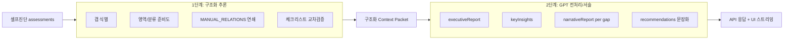

# ISMS-P 갭 분석: Verbalizing Inference 아키텍처 (가정 설계)

> **목적**  
> 자체진단 Lab의 갭/리스크 분석 화면을, GPT API를 활용한 **Verbalizing Inference(구조화 추론 → 자연어 서술)** 파이프라인으로 구현했다고 가정할 때의 설계를 정리합니다.  
> 동시에 **현재 화면에 나오는 결과가 AI 기반 분석이라면 타당한지**를 검증합니다.

---

## 1. Verbalizing Inference란 (본 프로젝트 맥락)

일반적인 “AI가 통제를 판단한다”와 달리, 본 설계에서 Verbalizing Inference는 다음 두 단계로 정의합니다.

| 단계 | 역할 | 담당 |
| --- | --- | --- |
| **1. 구조화 추론 (Deterministic Inference)** | 셀프진단 입력, 통제 그래프, 체크리스트 KB를 조합해 **사실(facts)만** 산출 | 규칙 엔진 (Python) |
| **2. 버벌라이징 (Verbalization)** | 산출된 facts를 **심사관/담당자가 읽을 수 있는 서술**로 변환 | GPT API |

핵심 원칙:

- **추론의 근거는 코드/그래프/KB에 고정**한다. LLM은 새 통제나 새 결함을 “창작”하지 않는다.
- LLM은 **요약/연결/우선순위 설명/AI 리포트**만 담당한다.
- 숫자(준비도 %, 갭 건수)와 통제 ID 목록은 **1단계 결과를 그대로** 사용한다.

이 구조는 RAG/에이전트보다 구현 부담이 낮고, 감사/면접에서 **“왜 이 통제가 위험한지”**를 설명하기에 적합합니다.

---

## 2. 가정 아키텍처 전체 흐름



### 2.1 입력

```json
{
  "assessments": {
    "2.7.1": "none",
    "2.7.2": "none",
    "2.9.4": "partial"
  }
}
```

- `unknown | none | partial | done | evidenced` 5단계
- 브라우저 `localStorage`에 저장된 학습용 상태

### 2.2 1단계 산출물: Context Packet (GPT에 넘기는 전처리 JSON)

통제당 갭이 있을 때, 아래와 같은 **고정 스키마**를 만듭니다.

```json
{
  "controlId": "2.9.4",
  "title": "로그 및 접속기록 관리",
  "level": "partial",
  "levelLabel": "부분 이행",
  "areaName": "보호대책 요구사항",
  "categoryName": "시스템 및 서비스 운영관리",
  "riskIfMissing": "로그 미수집/미보관 시 사고 추적 불가...",
  "controlFocus": "로그 수집 범위/보관/무결성 점검",
  "checklistBreakdown": [
    {
      "item": "주요 시스템 로그 수집 여부",
      "operationalRisk": "...",
      "auditRisk": "...",
      "relatedControls": ["2.9.5", "2.11.3"]
    }
  ],
  "cascadeRisks": [
    {
      "targetControlId": "2.9.5",
      "connectionReason": "수집한 로그는 정기 점검 대상으로 이어집니다.",
      "targetLevel": "none"
    }
  ],
  "consequenceScenarios": ["...", "...", "..."],
  "immediateActions": ["...", "..."]
}
```

전체 분석용 패킷에는 추가로:

- `overallReadiness`, `statusCounts`, `areaReadiness`, `weakCategories`
- `cascadeChains` (상위 갭 12건 기준)
- `topGaps` (우선순위 정렬, 최대 50건)

**이 패킷 생성 로직**이 현재 코드의 `control_assessment.py` + `control_insight_kb.py`에 해당합니다.

### 2.3 2단계: GPT Verbalization (가정)

#### 호출 전략

| 대상 | 방식 | 이유 |
| --- | --- | --- |
| `executiveReport` | 1회 호출 (전체 패킷) | 종합 서술, 토큰 효율 |
| `keyInsights` | 동일 응답에서 bullet 4~6개 | 중복 호출 방지 |
| `narrativeReport` (통제당) | 상위 N개 갭만 배치 호출 또는 병렬 | 101건 전체 호출은 비용/지연 과다 |
| `recommendations[].detail` | 상위 12건 권고만 AI 리포트 | 템플릿 중복 제거 |

#### 시스템 프롬프트 (요지)

```
당신은 ISMS-P 자가진단 보조 분석가입니다.
입력 JSON의 사실만 사용하세요. 통제 ID/건수/%를 변경하거나 새 통제를 만들지 마세요.
출력: 한국어, 심사 대응 회의에 바로 쓸 수 있는 톤.
구조: [종합 평가] [영역별] [연쇄 리스크] [상위 갭] [우선 권고]
각 갭 narrativeReport는 [통제 진단][종합 판단][체크리스트 교차 검토][시나리오][연쇄 영향][우선 보완] 섹션을 유지하세요.
```

#### 사용자 메시지 (예시)

```
다음 Context Packet을 바탕으로 executiveReport와 keyInsights를 생성하세요.
JSON only가 아닌 읽기 쉬운 리포트 텍스트로 반환하세요.

{context_packet_json}
```

#### 후처리 (필수)

- 통제 ID 정규식 검증 (`\d+\.\d+\.\d+`가 패킷 subset인지)
- `overallReadiness`, `gapCount` 숫자 일치 검증
- 실패 시 **1단계 템플릿 서술로 폴백** (현재 `control_insight_verbalize.py` 동작)

---

## 3. 현재 구현과의 대응 관계

| 가정(GPT) 단계 | 현재 코드 | 비고 |
| --- | --- | --- |
| Context Packet 생성 | `control_assessment.analyze_assessment()` | 동일 |
| 체크리스트/시나리오 KB | `control_insight_profiles.py`, `control_insight_categories.py`, `control_insight_overrides.py` | 동일 |
| 연쇄 추론 | `MANUAL_RELATIONS` + `build_cascade_risks()` | 동일 |
| Verbalization | `control_insight_verbalize.py` (템플릿) + `verbalize_inference.py` (옵션 LLM) | `verbalize=true`일 때 LLM 서술, 검증 실패 시 템플릿 폴백 |
| UI 스트리밍 연출 | `control_map.html` `runAnalysis()` | GPT 사용 여부와 무관 |
| API 스키마 | `schemas.py` `AssessResponse` | `verbalizeMeta`로 적용/폴백 상태 노출 |

**정리:** 1단계 규칙 엔진은 그대로 두고, 2단계 facts-only Verbalizing이 `verbalize_inference.apply_verbalizing()`으로 연결되었습니다.

---

## 4. 화면 결과 검증 (제공 스크린샷 기준)

아래는 **모든 통제를 미이행/미점검에 가깝게 둔 극단 케이스**로 보이며, 그 전제에서 AI 분석 결과가 맞는지 판단합니다.

### 4.1 맞는 결과 (AI를 써도 동일하게 나와야 함)

| 화면 요소 | 관측값 | 판단 |
| --- | --- | --- |
| 전체 준비도 | 약 10.5% | `none` 위주 101건이면 `LEVEL_SCORES`상 5점 근처 → **타당** |
| 갭 수 | 101건 | `unknown/none/partial`만 갭으로 집계 → **타당** |
| 영역별 준비도 | 관리체계 > 보호대책 > 개인정보 | 영역별 평균 점수 차이 → **타당** |
| 취약 분류 | 위험 관리 5% 등 | 분류별 평균 → **타당** |
| 이행 현황 | 미이행 87건 등 | 입력 상태의 집계 → **타당** |
| 연쇄 리스크 | 2.7.1→2.7.2, 2.7.1→3.1.3 등 | `MANUAL_RELATIONS`에 정의된 관계 → **타당** |
| 우선 권고 | 범위/정책/자산 선행, 취약 영역 집중 | 준비도 < 35% 규칙 + weak category → **타당** |
| 부분 이행 필터 시 0건 | 스크린샷 3/4 | 전체가 `none`이면 partial 필터 0건 → **정상 UX** |

**결론:** 대시보드의 **숫자/구조/연쇄 방향**은 AI가 아니라 규칙 엔진 산출물이 맞고, GPT를 쓴다 해도 **이 부분은 바뀌지 않는 것이 정상**입니다.

### 4.2 AI라면 더 나아져야 하는 부분 (현재는 템플릿 티)

| 현상 | 원인 (현재 구현) | GPT Verbalization 시 기대 |
| --- | --- | --- |
| 연쇄 카드 문장 중복 | `connectionReason` + `impact`에 동일 `reason`이 “연결:”으로 두 번 노출 | 한 문단으로 통합/가독성 개선 |
| 2.7.1 / 2.7.2 권고 문구 동일 | 카테고리 공통 `recommendedActions` 템플릿 | 통제별 차별화 서술 (정책 vs 키관리) |
| 연쇄 카드 톤 반복 | `CASCADE_IMPACT_TEMPLATES` 고정 패턴 | 문장 변주, 맥락 강조 |
| 갭 카드 요약 | `organicAnalysis` 접두 패턴 유사 | 통제별 맞춤 내러티브 |
| 심층 리포트 | 섹션 제목은 풍부하나 문체가 규칙적 | executive 톤/우선순위 설명이 더 “분석가” 스타일 |

**결론:** 스크린샷의 **레이아웃/데이터는 AI 분석 결과로 설득력 있음**. 다만 **문장 품질만 보면 “규칙 템플릿 + UI 연출”**에 가깝고, GPT를 실제로 썼다면 **중복/반복이 줄고 통제별 차별화**가 더 뚜렷해야 합니다.

### 4.3 AI를 썼을 때 오히려 위험한 것 (하지 않아야 함)

- 준비도 %를 “그럴듯하게” 수정
- 존재하지 않는 통제 ID 인용
- 심사 **합격/불합격** 단정
- 조직 실증적 증적 없이 “이행 완료” 서술

현재 UI 하단 면책(“실제 인증 심사 판단을 대체하지 않음”)은 GPT 사용 시에도 **반드시 유지**해야 합니다.

---

## 5. GPT API 전처리 파이프라인 (구현 시 의사코드)

```python
def analyze_with_verbalizing_inference(assessments: dict[str, str]) -> dict:
    # 1단계: 규칙 엔진 (기존과 동일)
    structured = analyze_assessment(assessments)

    # 전처리: GPT에 넘길 크기 제한
    verbalize_packet = {
        "summary": {
            "overallReadiness": structured["overallReadiness"],
            "readinessLabel": structured["readinessLabel"],
            "gapCount": structured["gapCount"],
            "statusCounts": structured["statusCounts"],
            "areaReadiness": structured["areaReadiness"],
            "weakCategories": structured["weakCategories"][:5],
        },
        "cascadeChains": structured["cascadeChains"][:8],
        "topGaps": [
            {
                "controlId": g["controlId"],
                "title": g["title"],
                "levelLabel": g["levelLabel"],
                "controlFocus": g["controlFocus"],
                "riskIfMissing": g["riskIfMissing"],
                "checklistBreakdown": g["checklistBreakdown"][:4],
                "cascadeRisks": g["cascadeRisks"][:3],
                "consequenceScenarios": g["consequenceScenarios"][:3],
                "immediateActions": g["immediateActions"][:3],
            }
            for g in structured["topGaps"][:12]
        ],
    }

    # 2단계: GPT (가정)
    if os.getenv("OPENAI_API_KEY"):
        llm = openai_client.chat.completions.create(
            model="gpt-4o-mini",
            messages=[
                {"role": "system", "content": SYSTEM_PROMPT},
                {"role": "user", "content": json.dumps(verbalize_packet, ensure_ascii=False)},
            ],
            temperature=0.3,
        )
        structured["executiveReport"] = parse_executive_report(llm)
        structured["keyInsights"] = parse_key_insights(llm)
        for gap, narrative in zip(structured["topGaps"][:12], parse_narratives(llm)):
            gap["narrativeReport"] = narrative
    # else: structured 그대로 (현재 템플릿 verbalize)

    return structured
```

**비용/지연 가이드 (참고)**

- `gpt-4o-mini`, 상위 12갭 + 종합 1콜: 대략 수천 토큰/요청
- 101통제 전수 서술은 불필요 → **상위 우선순위만 LLM**이 실무적 선택

---

## 6. UI 연출과 AI 인지의 관계

분석 버튼 클릭 후:

1. 5단계 진행 표시 (스캔 → 연쇄 → 체크리스트 → 시나리오 → 리포트)
2. `keyInsights` 순차 등장
3. `executiveReport` 타이핑 스트리밍
4. 갭 카드 순차 fade-in

이 연출은 **GPT 응답 대기 시간을 자연스럽게 만드는 UX**로도 쓰입니다.  
즉, AI를 붙여도 화면 흐름은 유지하고 **2단계 응답이 도착하는 동안 1단계 수치를 먼저 보여주는** 하이브리드가 적절합니다.

---

## 7. 포트폴리오/면접 표현 가이드

### 권장 표현

- “셀프진단 결과를 **통제 관계 그래프와 체크리스트 KB로 구조화 추론**한 뒤, **LLM으로 Verbalizing Inference 리포트**를 생성하는 파이프라인을 설계했다.”
- “추론은 결정론적 규칙, **자연어화만 LLM**에 위임해 환각 리스크를 줄였다.”
- “상위 갭 N건에 대해 **Context Packet 기반** narrative를 생성하고, 나머지는 템플릿 폴백한다.”

### 피해야 할 표현

- “GPT가 ISMS-P 인증 적합 여부를 판정한다”
- “AI 심사관”
- “101개 통제를 AI가 자동 학습해 평가” (학습/판정 아님)

### 현재 저장소 기준 한 줄

> **구현:** 규칙 기반 추론 + (옵션) facts-only LLM Verbalizing + Self-Correction 폴백 + 스트리밍 UI  
> **사용:** `POST /controls/analyze`에 `verbalize: true` + `OPENAI_API_KEY`(또는 `PII_TOOLKIT_OPENAI_API_KEY`)

---

## 8. 요약 판단

| 질문 | 답 |
| --- | --- |
| AI로 돌렸다고 가정해도 **이 화면 구성**이 맞는가? | **예.** 준비도/갭/연쇄/권고 구조는 Verbalizing Inference의 정석적 출력 형태와 일치 |
| **지금 보이는 문장**이 GPT 결과처럼 보이는가? | **부분적으로만.** 수치/관계는 맞으나, 반복 문구/연쇄 카드 중복은 템플릿 특성 |
| GPT 전처리가 **어려운 작업**인가? | **아님.** 1단계 JSON이 이미 있으므로 프롬프트/검증/폴백만 추가하면 됨 |
| 면접에서 “AI 활용”으로 말해도 되는가? | **설계/파이프라인 관점에서는 가능.** 단, **실제 API 연동/운영 여부**는 사실대로 구분할 것 |

---

## 9. 관련 파일

| 파일 | 역할 |
| --- | --- |
| `src/isms_pii_toolkit/control_assessment.py` | 분석 오케스트레이션, API 응답 조립 |
| `src/isms_pii_toolkit/control_insight_kb.py` | 갭 인사이트/연쇄 추론 |
| `src/isms_pii_toolkit/control_insight_verbalize.py` | 템플릿 Verbalization (폴백) |
| `src/isms_pii_toolkit/verbalize_inference.py` | Context Packet / LLM 호출 / Self-Correction |
| `src/isms_pii_toolkit/control_graph.py` | `MANUAL_RELATIONS` 통제 관계 |
| `src/isms_pii_toolkit/control_map.html` | 분석 UI/스트리밍 연출 / LLM 서술 토글 |
| `POST /controls/analyze` | `verbalize` 플래그 지원 |

---

*문서 버전: 2026-06-22 / ISMS-P 자체진단 Lab 갭 분석 기준*
